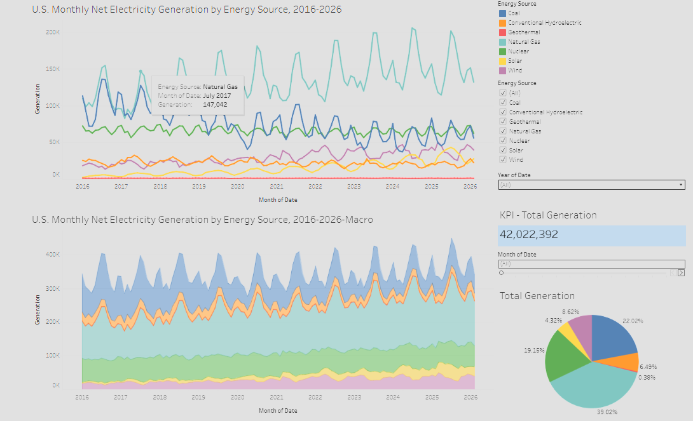

# U.S. Electricity Generation Dashboard

## Overview

This project is an interactive Tableau dashboard focused on U.S. monthly net electricity generation trends from 2016–2026. The dashboard analyzes how different energy sources contribute to overall electricity production and highlights changes in the American energy mix over time

https://public.tableau.com/app/profile/ryan.garcia4428/viz/U_S_MonthlyNetElectricityGenerationbyEnergySource2016-20261/Dashboard1?publish=yes

The project was created to strengthen skills in:
- Data analytics
- Data visualization
- Dashboard design
- Energy market analysis
- Interactive reporting

---

## Dashboard Features

- Monthly electricity generation trends
- Energy source comparison
- Renewable vs non-renewable analysis
- Interactive filters
- KPI summary metrics
- Time-series visualization
- Portfolio-style dashboard formatting

---

## Data Sources

Dataset includes monthly U.S. net electricity generation data across major energy sources, including:

- Natural Gas
- Coal
- Nuclear
- Wind
- Solar
- Hydroelectric
- Petroleum
- Other Renewables

Source data is based on publicly available U.S. energy statistics.

---

## Tools & Technologies

- Tableau
- Microsoft Excel
- CSV Data Processing
- Data Cleaning
- Interactive Dashboard Design

---

## Key Objectives

This dashboard was designed to:
- Identify long-term generation trends
- Compare energy production sources
- Visualize renewable energy growth
- Present complex data in a user-friendly format
- Build a professional analytics portfolio project

---

## Current Development Status

Project is currently in development and undergoing continued improvements.

Planned updates include:
- Enhanced dashboard styling
- Additional KPI metrics
- Improved mobile readability
- Expanded analytical insights
- Published Tableau Public version

---

## Repository Structure

```text
U.S.-Electricity-Generation-Dashboard/
│
├── data/
│   └── Net_generation_United_States_all_sectors_monthly.csv
│
├── dashboard/
│   └── U.S. Monthly Net Electricity Generation by Energy Source.twb
│
├── images/
│   └── dashboard-preview.png
│
└── README.md
```

---

## Preview



---

## Author

Self-employed Data Analytics Projects  
Focused on dashboard development, visualization, and analytical reporting.

---

## License

This project is intended for educational and portfolio purposes.
